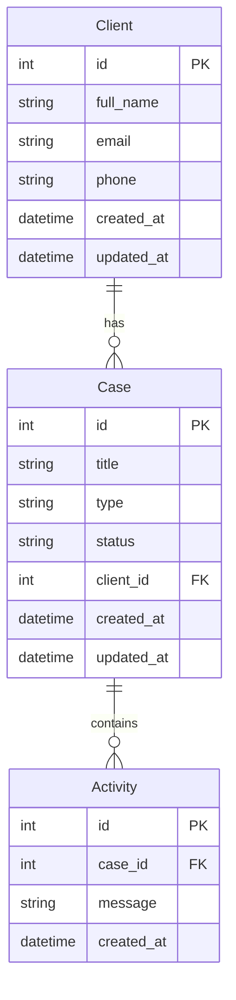

# CaseFlow — Entity Relationship Diagram (ERD)

This document describes the database structure used by CaseFlow, including the entities (Client, Case, Activity) and their relationships.

---

## 1. Text ERD (Developer-Friendly)

### Client

- id (PK)
- full_name
- email
- phone
- created_at
- updated_at

### Case

- id (PK)
- title
- type
- status
- client_id (FK → Client.id)
- created_at
- updated_at

### Activity

- id (PK)
- case_id (FK → Case.id)
- message
- created_at

### Relationships

- One **Client** can have many **Cases**
- One **Case** can have many **Activities**

ASCII Diagram:
Client (1) ───────── (∞) Case (1) ───────── (∞) Activity

---

## 2. Visual ERD (Mermaid Diagram)

